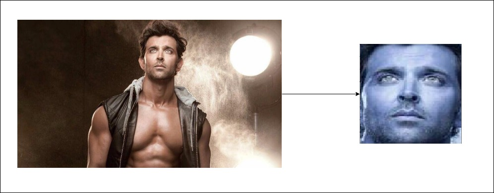
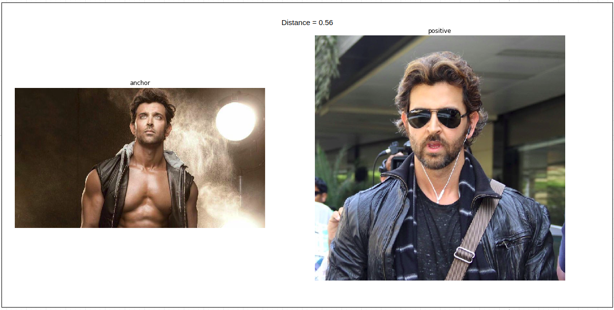
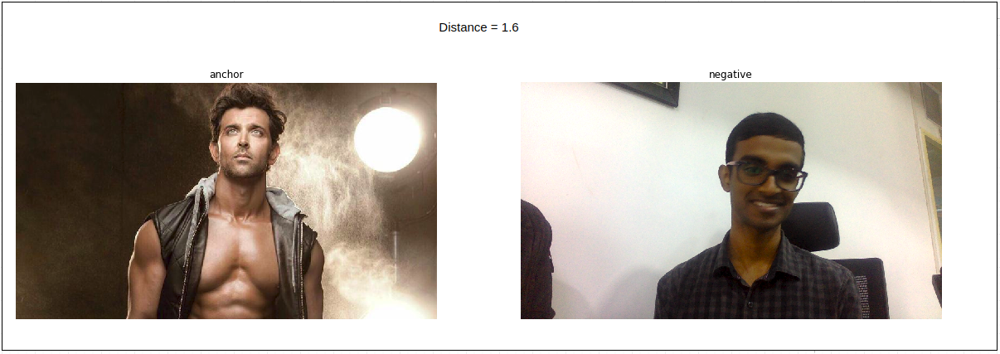

## A Web Application for Face Recognition using any camera source.

In this blog post, we will see how to create a web application for facial recognition. This application can serve as the basis for a real-time facial recognition system at your company/college. We use the latest pre-trained deep learning models. We will start by exploring the architecture of the system and as we move along, dive into the details.

Here is a look at the overall setup of the system.

- React Front End: Accesses the web camera, send frames for prediction 
- Flask Back End: Receive frames, push frames through the face recognition engine, return predictions.
- Face Recognition Engine: Localize faces in a frame, predict the person to whom the face belongs to. 

Let us see how the face recognition engine operates:

### 1. FaceDetecor: 

- Receives an image from the camera source, finds the location of the face in the image.

There are multiple pre-trained detectors available online: [mtcnn](https://github.com/ipazc/mtcnn), [face_recognition](https://github.com/ageitgey/face_recognition). But for our real-time use case, we need a really fast detector. After benchmarking several detectors, I found that opencv's [dnn](https://github.com/opencv/opencv/tree/master/samples/dnn/face_detector) face detector has an inference time that is an order of magnitude better than mtcnn, and other detectors. This network is based on SSD Framework with a resnet-10 like architecture.

Here's a look at what enters the detector and leaves the detector.

Have a look at the FaceDetector class [here](https://github.com/mohankumarSriram/face-detector-app/blob/master/services/face_detector.py).

### 2. Face Describer: 

- Receives the cropped face and converts it into a multi-dimensional embedding vector

For our face recognition system, we have two main requirements.
1. Whenever a new person needs to be added for recognition, the number of photos of the person might be limited. The system must be capable of picking up the person with a handful of examples.
2. Any unauthorized person who enters the system must be clearly identified as a stranger.

Traditional neural network architectures with softmax classifiers suffer from two main drawbacks:
 1. Whenever a new person enters the company, we need to add a new label and retrain the entire network.
 2. Fixed classifiers are incentivized to classify an unkown person into one of the already available labels with great confidence. Such strong false positives, lead to intruder detection problems.

In order to circumvent these problems, the [facenet](https://arxiv.org/abs/1503.03832) paper presents a new approach to identity recognition. 
1. The network transforms the input image to a multi-dimensional embedding (128D vector). 
2. The embedding network is trained using a triplet loss. A Triplet of images: anchor, positive, and negative are chosen in such a way that the anchor and positive belong to the same class, whereas the negative belongs to a different class. The Loss function is shown in the following equation. 
$ d(anchor, positve) + \delta < d(anchor, negative) $. 
The network is trained to minimize inter-class distances and maximize intra-class distances.
3. For each of the labels, we can produce an average vector of the all the embedding vectors belonging to the same class. We thus obtain 128 dimensional vectors for each of our labels.

Have a look at the FaceDescriber class [here](https://github.com/mohankumarSriram/face-detector-app/blob/master/services/face_describer.py)

### Face Verifier: 

- Receives the embedding vector, compares with existing vectors to produce the most similar class

1. During the time of inference, we calculate the similarity measure between the stored embedding vectors for each of the classes and the new embedding.
2. We use these similarity distances to assign the most similar (min-distance) class.

You can find the Faceverifier class [here](https://github.com/mohankumarSriram/face-detector-app)

Here's a look at the entire application!

### Github repo: https://github.com/mohankumarSriram/face-detector-app

### Conclusion

In this blog, you have seen how to build a face recognition app using web camera. Please contact me if you need help setting up the app for an IP camera or any other source. Don't forget to fork the repo and give it a star! If you have any feature requests, feel free to create a new issue on the repo.

I currently provide full stack machine learning and deep learning solutions, you can reach me at mohankumarsriram7@gmail.com

### References

1. Florian Schroff, Dmitry Kalenichenko, James Philbin. ["FaceNet: A Unified Embedding for Face Recognition and Clustering.”](https://arxiv.org/abs/1503.03832)
2. [Facenet with SVM](https://machinelearningmastery.com/how-to-develop-a-face-recognition-system-using-facenet-in-keras-and-an-svm-classifier/)
3. [Server Structure](https://github.com/AIInAi/tf-insightface)

