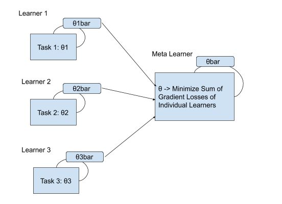
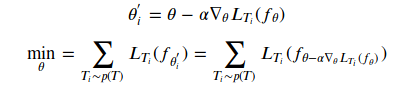

Welcome to this first post on meta learning! This post assumes that the reader is already familiar with the basic neural network architectures and their training processes. Assuming you are ready, let's begin!

Humans are the ultimate adaptation machines. We can act and adapt intelligently to a wide range of new, unseen situations and tasks at an incredibly fast pace. Although there has been a huge hype about Artificial General Intelligence, the current state of the art AI systems are far from versatile. Many of the recent achievements [GPT-2](https://openai.com/blog/better-language-models/), [Alpha-Zero](https://deepmind.com/blog/alphazero-shedding-new-light-grand-games-chess-shogi-and-go/), and [Dractyl](https://openai.com/blog/learning-dexterity/), fall into a category of systems which have perfected a narrow skill with thousands of hours of training on huge GPU clusters using millions of data-points. These systems can struggle to perform seemingly simple tasks such as turning door knobs which they have not seen before.   

An alternative approach could be to build purely control systems based machines with fully defined state spaces for a few selective manouvers, such as [Boston Dynamics](https://www.bostondynamics.com/)'s quirky [Spot](https://www.bostondynamics.com/spot)  

But if we are to come anywhere close to human-level adaptability, we need our agents to not only learn a particular skill from scratch (in isolation) but more importantly learn how to learn new tasks by resusing experience from past tasks. As you might have expected, we have a bunch of brilliant minds already working on this hard problem! A new sub-field in artificial intelligence called 'Meta-Learning' or 'Learning to Learn' has emerged with the aim of learning to perform a wide range of tasks with sparse data.

You can find the current state of the art meta learning approaches below:
- Prototypical-Nets
- MAML
- Memory Mod
- Neural Statistician
- Matching Nets
- Reptile + Transduction

In this blog post, we will explore one of the learning to learn approaches called "Model-Agnostic Meta-Learning" which is simple yet effective. "Model-Agnostic" because the approach works for multiple domains including supervised regression, classification and reinforcement learning. We will discuss the intuition, core algorithm, and also link to an implementation. 

### Intuition

<h5>
Fig 1
</h5>

The Main intuition behind the MAML algorithm is depicted in Fig 1.

In every iteration of the training process, we begin by finding the optimal parameters(weights) of the model for each of the tasks individually through independent gradient descents (equation in Fig 2). We obtain a set of optimal parameters [𝜃bar], these parameters are used to compute the optimal parameter for the meta learner (𝜃) by performing another gradient descent step (equation in Fig 3). 

Note: Optimal parameter (𝜃) corresponds to all the weights required for the model.

### Algorithm

<h5>
Fig 2
</h5>

### Training Process

<h5>
Fig 3
</h5>

Overall, MAML algorithm produces a weight initialization that results in easily adaptable model parameters. This allows the model to perform well on new tasks with few examples.

To get up and running with MAML, please refer to [this](https://github.com/mohankumarSriram/maml.git) Pytorch implementation of the algorithm which works with the latest versions of Python and Pytorch.

Note: My Implementation is adapted from the original implementation [here](https://github.com/katerakelly/pytorch-maml)

On the next post, we will explore the application of MAML in a reiforcement learning setting.

### Reference
1.  Chelsea Finn, Pieter Abbeel, and Sergey Levine. ["Model-agnostic meta-learning for fast adaptation of deep networks.”](https://arxiv.org/abs/1703.03400) ICML 2017
2. Brenden M. Lake, Ruslan Salakhutdinov, and Joshua B. Tenenbaum. [“Human-level concept learning through probabilistic program induction.”](https://science.sciencemag.org/content/350/6266/1332.full) Science 350.6266 (2015): 1332-1338.
2. Chelsea Finn’s BAIR blog on [Learning to Learn](https://bair.berkeley.edu/blog/2017/07/18/learning-to-learn/)
3. Siavash Khodadadeh's lecture on [MAML](https://youtu.be/wT45v8sIMDM)
4. Papers with code: [Few shot learning](https://www.paperswithcode.com/sota/few-shot-image-classification-on-omniglot-1)
