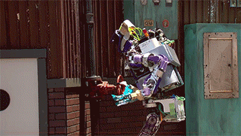
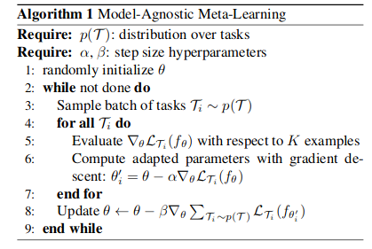

Welcome to our first post on meta-learning! Although I would have loved to address a wide audience, I had to invariably make a few assumptions about the audience for this post. Please refer to the pre-requisites at the tail-end of the post before proceeding to read. 


Humans are the ultimate adaptation machines. We can act and adapt intelligently to a wide range of new, unseen situations and tasks at an incredibly fast pace. Although there has been a huge hype about Artificial General Intelligence, the current state of the art AI systems are far from being versatile. Many of the recent achievements [GPT-2](https://openai.com/blog/better-language-models/), [Alpha-Zero](https://deepmind.com/blog/alphazero-shedding-new-light-grand-games-chess-shogi-and-go/), and [Dractyl](https://openai.com/blog/learning-dexterity/), among others fall into the category of systems which have perfected a narrow skill with thousands of hours of training on huge GPU clusters using millions of data-points. These systems can struggle to perform seemingly simple tasks such as turning door knobs which they have not seen before.   



An alternative approach could be to build purely control systems based machines with fully defined state spaces for a few selective manouvers, such as [Boston Dynamics](https://www.bostondynamics.com/)'s quirky [Spot](https://www.bostondynamics.com/spot)  


But if we are to come anywhere close to human-level adaptability, we need our agents to not only learn a particular skill from scratch (in isolation) but more importantly learn how to learn new tasks by resusing experience from past tasks. As you might have expected, we have a bunch of brilliant minds already working on this hard problem! A new sub-field in artificial intelligence called 'Meta-Learning' has emerged with the aim of learning to perform a wide range of tasks with sparse data.

You can find below the current state of the art meta learning approaches:
- Prototypical-Nets
- MAML
- Memory Mod
- Neural Statistician
- Matching Nets
- Reptile + Transduction

In this blog post, we will explore one of the learning to learn approaches which is simple yet effective called "Model Agnostic Meta Learning". "Model-Agnostic" because the approach works for multiple domains including supervised regression, classification and reinforcement learning. We will discuss the intuition, core idea, and also link to a pytorch implementation of the algorithm. 

### Intuition

### Problem Definition

- Model f parameterized by $\theta$
    * Maps x $\rightarrow$ a
    * p(T): tasks distribution
    * T = {L$(x_1, a_1, ...., x_H, a_H)$, $q(x_1)$, $q(x_{t+1}|x_t, a_t)$, H )}
        * Supervised Learning: H=1
    * K-shot learning: K samples drawn from $q_i$
    

### Algorithm

##### Objective

$$ \theta_{i}^{'} = \theta - \alpha \nabla_{\theta} L_{T_i}(f_\theta) $$

$$ \min_{\theta} = \sum_{T_i\sim p(T)}L_{T_i}(f_{\theta_{i}^{'}}) = \sum_{T_i\sim p(T)}L_{T_i}(f_{\theta - \alpha \nabla_{\theta} L_{T_i}(f_\theta)})  $$

#### Training Process



### What is the problem?

Two aspects of human conceptual knowledge have eluded exisiting machine learning systems:
- People can learn a new concept from one or a handful of examples. Eg: We don't touch a hot stove twice ;), We don't wait for the batteries to run out before plugging in the charger. 
- People learn richer representations than machines do, even for simple concepts, using them for wide range of functions
  including creating new examples, parsing objects into parts and relations, and creating new abstract categories of   objects based on existing categories. Eg: We come up with myriad of reasons for why our best friend didn't reply immediately to our text,  

### Why should we solve this problem?
- Modern deep learning approaches require tons of training data to perform super-human yet narrow range of tasks.
    (Read GPT-2, Bert, and you Alpha Zero!)
- These approaches are cost intensive, and resource intensive.
- With the Learning to learn* approach, Machines can work using a more generalizable model with easily adaptible parameters.
- This model can parse knowledge from past tasks to accomplish a wide variety of new tasks using very few examples or training data.

tl;dr: Less data, Less training, Less compute, More profits

##### * Learning to learn
- The Ability to perform previously unseen tasks with a handful of examples is the "to learn" part.
- The way in which a machine gains this ability is termed as "Learning to learn".

### What are the existing state of the art techniques to solve the problem?
- Prototypical-Nets
- MAML
- Memory Mod
- Neural Statistician
- Matching Nets
- Reptile + Transduction

1: [Few shot learning: Papers with code](https://www.paperswithcode.com/sota/few-shot-image-classification-on-omniglot-1)


### Our Approach
- Model-Agnostic Meta-Learning (MAML)
- If possible, we will cover Probabilistic Model-Agnostic Meta-Learning 

##### Key concept:
- Produces a weight initialization that results in easily adaptable model parameters through gradient descent.

#### Show me the code!


```python

```


```python

```


```python

```


```python

```

#### Dependencies
- Anaconda: v4.5.12
- Pytorch: v1.1

#### Commands used:
```
conda install pytorch-cpu torchvision-cpu -c pytorch
conda install -c conda-forge click 

```

### Pre-requisites
- Artificial Neural Networks - Strucuture, Training and Scoring
- Reinforcement Learning - Markov Decision Processes.

### Reference
1. [Few shot learning: Papers with code](https://www.paperswithcode.com/sota/few-shot-image-classification-on-omniglot-1)
2. [Chelsea Finn's Blog](https://bair.berkeley.edu/blog/2017/07/18/learning-to-learn/)
3. [Siavash Khodadadeh's lecture](https://youtu.be/wT45v8sIMDM)


```python

```
