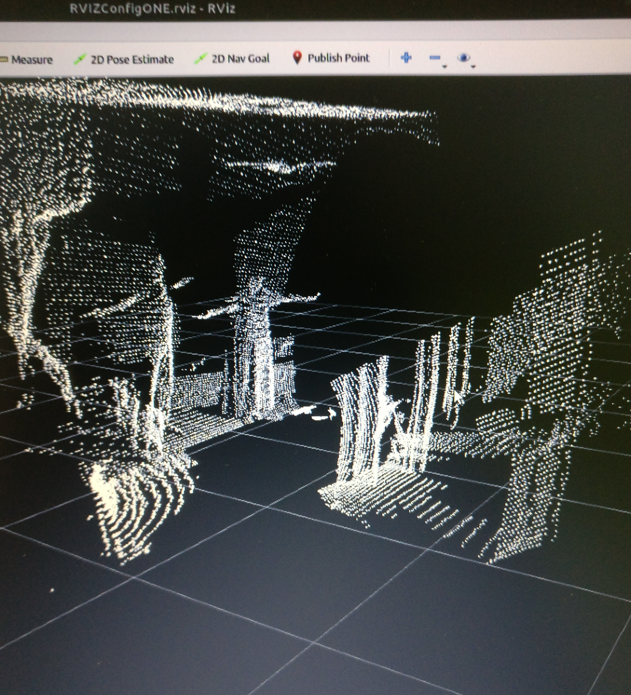

## A 3D-scan assembler to generate point clouds from a 2D-LIDAR.

I recently had the opportunity to work on an interesting challenge for a client. Given a 2D-LIDAR, How can we generate a 3D Point cloud of the environment? Although the problem looked daunting initially, I was able to break down the problem into fundamental components and deliver a functioning solution within 4 weeks. In this short post, we will have an high level overview of the system.

Here is one snapshot of the 3D depth map generated by the system

The system consists of two important components:
1. Mechanical system that rotates the 2D-LIDAR around the third dimension. Every degree of rotation helps us acquire new 2D-depth information.
2. Software system (ROS Node) that keeps track of the past 2D frames and stiches them together into a cohesive 3D map.

The design challenges mainly revolved around repeatability and power consumption. 

Have a look at the system in action.

If you have similar requirements or another challenging project, feel free to reach out to me.